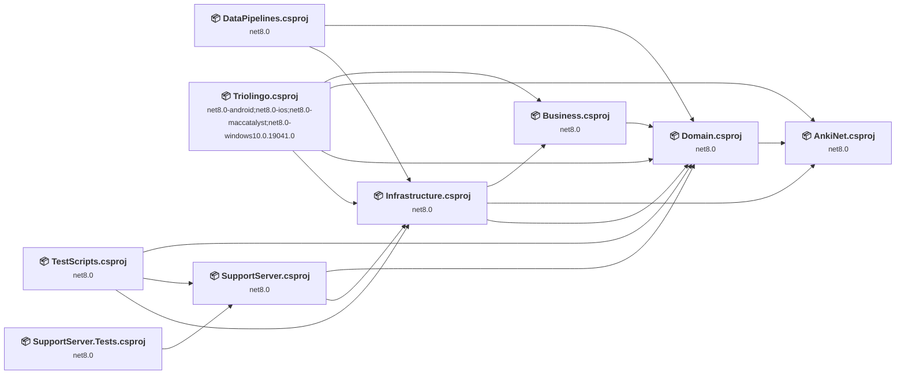
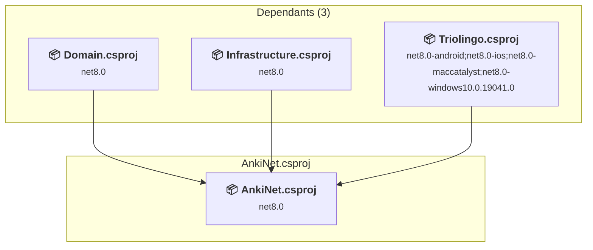
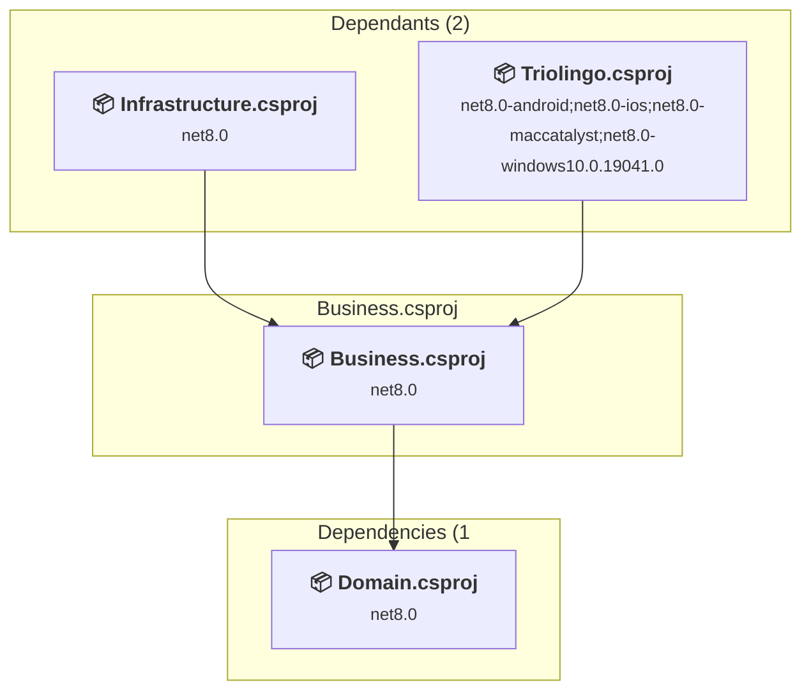
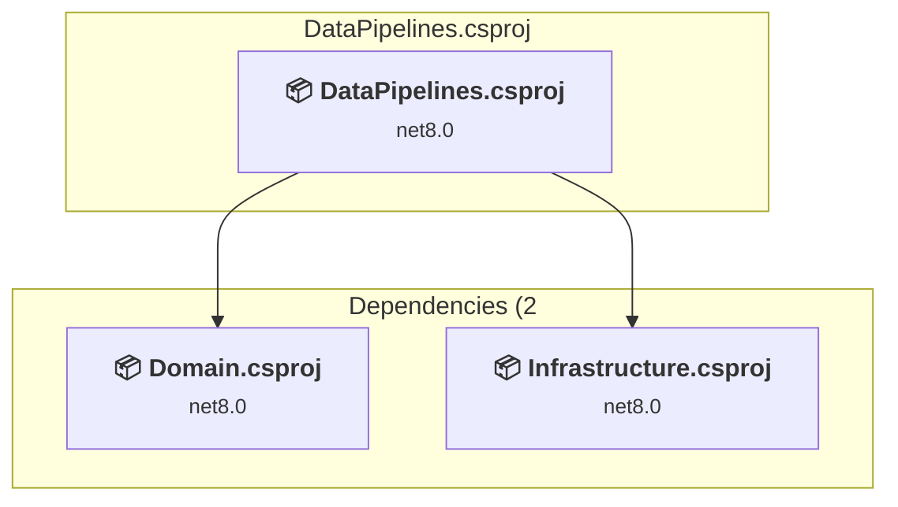
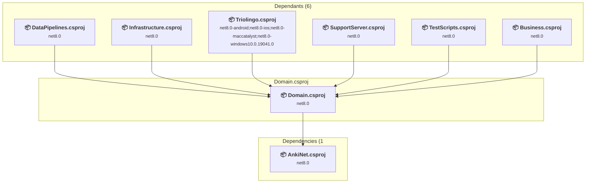
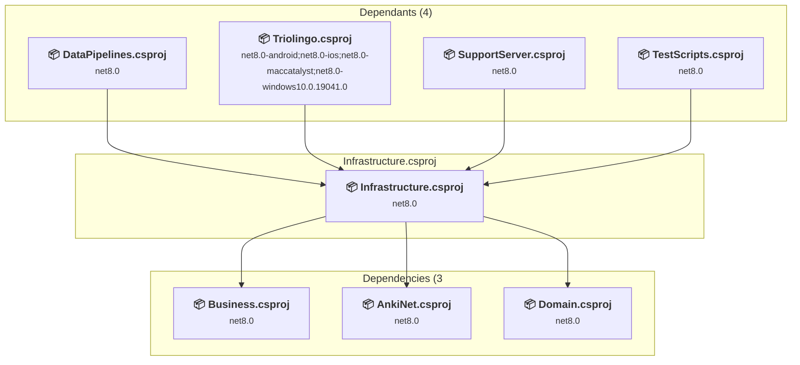
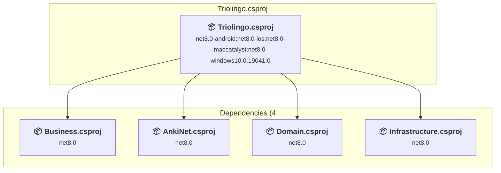
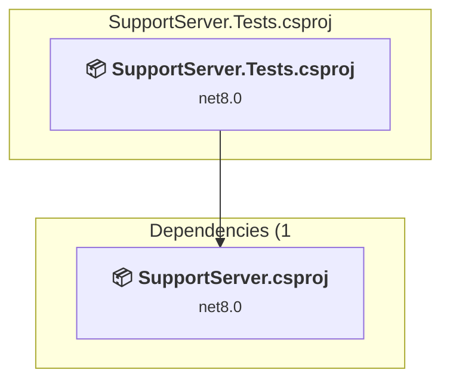
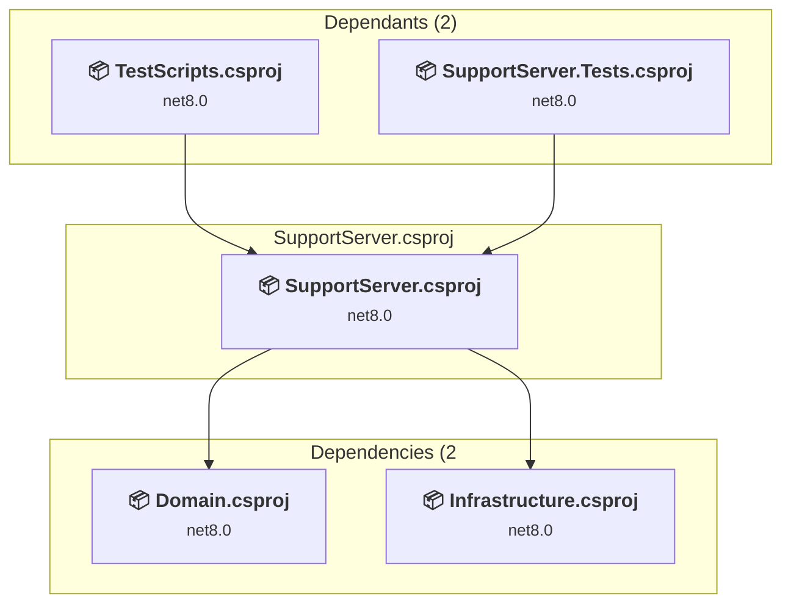
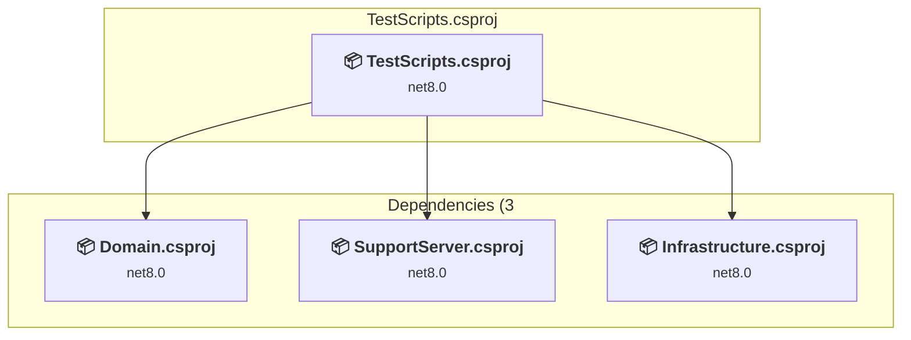

# Projects and dependencies analysis

This document provides a comprehensive overview of the projects and their dependencies in the context of upgrading to .NETCoreApp,Version=v10.0.

## Table of Contents

- [Executive Summary](#executive-Summary)
  - [Highlevel Metrics](#highlevel-metrics)
  - [Projects Compatibility](#projects-compatibility)
  - [Package Compatibility](#package-compatibility)
  - [API Compatibility](#api-compatibility)
- [Aggregate NuGet packages details](#aggregate-nuget-packages-details)
- [Top API Migration Challenges](#top-api-migration-challenges)
  - [Technologies and Features](#technologies-and-features)
  - [Most Frequent API Issues](#most-frequent-api-issues)
- [Projects Relationship Graph](#projects-relationship-graph)
- [Project Details](#project-details)

  - [AnkiNet\AnkiNet.csproj](#ankinetankinetcsproj)
  - [Business\Business.csproj](#businessbusinesscsproj)
  - [ConsoleTests\DataPipelines.csproj](#consoletestsdatapipelinescsproj)
  - [Domain\Domain.csproj](#domaindomaincsproj)
  - [Infrastructure\Infrastructure.csproj](#infrastructureinfrastructurecsproj)
  - [MauiApp1\Triolingo.csproj](#mauiapp1triolingocsproj)
  - [SupportServer.Tests\SupportServer.Tests.csproj](#supportservertestssupportservertestscsproj)
  - [SupportServer\SupportServer.csproj](#supportserversupportservercsproj)
  - [TestScripts\TestScripts.csproj](#testscriptstestscriptscsproj)

## Executive Summary

### Highlevel Metrics

| Metric | Count | Status |
| :--- | :---: | :--- |
| Total Projects | 9 | All require upgrade |
| Total NuGet Packages | 43 | 13 need upgrade |
| Total Code Files | 224 |  |
| Total Code Files with Incidents | 36 |  |
| Total Lines of Code | 20203 |  |
| Total Number of Issues | 125 |  |
| Estimated LOC to modify | 103+ | at least 0,5% of codebase |

### Projects Compatibility

| Project | Target Framework | Difficulty | Package Issues | API Issues | Est. LOC Impact | Description |
| :--- | :---: | :---: | :---: | :---: | :---: | :--- |
| [AnkiNet\AnkiNet.csproj](#ankinetankinetcsproj) | net8.0 | 🟢 Low | 1 | 0 |  | ClassLibrary, Sdk Style = True |
| [Business\Business.csproj](#businessbusinesscsproj) | net8.0 | 🟢 Low | 1 | 1 | 1+ | ClassLibrary, Sdk Style = True |
| [ConsoleTests\DataPipelines.csproj](#consoletestsdatapipelinescsproj) | net8.0 | 🟢 Low | 0 | 0 |  | ClassLibrary, Sdk Style = True |
| [Domain\Domain.csproj](#domaindomaincsproj) | net8.0 | 🟢 Low | 0 | 0 |  | ClassLibrary, Sdk Style = True |
| [Infrastructure\Infrastructure.csproj](#infrastructureinfrastructurecsproj) | net8.0 | 🟢 Low | 7 | 62 | 62+ | ClassLibrary, Sdk Style = True |
| [MauiApp1\Triolingo.csproj](#mauiapp1triolingocsproj) | net8.0-android;net8.0-ios;net8.0-maccatalyst;net8.0-windows10.0.19041.0 | 🟢 Low | 2 | 39 | 39+ | DotNetCoreApp, Sdk Style = True |
| [SupportServer.Tests\SupportServer.Tests.csproj](#supportservertestssupportservertestscsproj) | net8.0 | 🟢 Low | 1 | 0 |  | DotNetCoreApp, Sdk Style = True |
| [SupportServer\SupportServer.csproj](#supportserversupportservercsproj) | net8.0 | 🟢 Low | 1 | 1 | 1+ | AspNetCore, Sdk Style = True |
| [TestScripts\TestScripts.csproj](#testscriptstestscriptscsproj) | net8.0 | 🟢 Low | 0 | 0 |  | DotNetCoreApp, Sdk Style = True |

### Package Compatibility

| Status | Count | Percentage |
| :--- | :---: | :---: |
| ✅ Compatible | 30 | 69,8% |
| ⚠️ Incompatible | 2 | 4,7% |
| 🔄 Upgrade Recommended | 11 | 25,6% |
| ***Total NuGet Packages*** | ***43*** | ***100%*** |

### API Compatibility

| Category | Count | Impact |
| :--- | :---: | :--- |
| 🔴 Binary Incompatible | 2 | High - Require code changes |
| 🟡 Source Incompatible | 5 | Medium - Needs re-compilation and potential conflicting API error fixing |
| 🔵 Behavioral change | 96 | Low - Behavioral changes that may require testing at runtime |
| ✅ Compatible | 28850 |  |
| ***Total APIs Analyzed*** | ***28953*** |  |

## Aggregate NuGet packages details

| Package | Current Version | Suggested Version | Projects | Description |
| :--- | :---: | :---: | :--- | :--- |
| AWSSDK.S3 | 4.0.18.6 |  | [Infrastructure.csproj](#infrastructureinfrastructurecsproj) | ✅Compatible |
| Catalyst | 1.0.54164 |  | [Infrastructure.csproj](#infrastructureinfrastructurecsproj) | ✅Compatible |
| Catalyst.Models.Chinese | 1.0.30952 |  | [Infrastructure.csproj](#infrastructureinfrastructurecsproj) | ✅Compatible |
| Catalyst.Models.English | 1.0.30952 |  | [Infrastructure.csproj](#infrastructureinfrastructurecsproj) | ✅Compatible |
| Catalyst.Models.German | 1.0.30952 |  | [Infrastructure.csproj](#infrastructureinfrastructurecsproj) | ✅Compatible |
| Catalyst.Models.Italian | 1.0.30952 |  | [Infrastructure.csproj](#infrastructureinfrastructurecsproj) | ✅Compatible |
| Catalyst.Models.Norwegian | 1.0.30952 |  | [Infrastructure.csproj](#infrastructureinfrastructurecsproj) | ✅Compatible |
| Catalyst.Models.Vietnamese | 1.0.30952 |  | [Infrastructure.csproj](#infrastructureinfrastructurecsproj) | ✅Compatible |
| CommunityToolkit.Maui | 8.0.1 |  | [Triolingo.csproj](#mauiapp1triolingocsproj) | ✅Compatible |
| CommunityToolkit.Mvvm | 8.4.0 |  | [Triolingo.csproj](#mauiapp1triolingocsproj) | ✅Compatible |
| coverlet.collector | 6.0.0 |  | [SupportServer.Tests.csproj](#supportservertestssupportservertestscsproj) | ✅Compatible |
| DeepL.net | 1.15.0 |  | [Infrastructure.csproj](#infrastructureinfrastructurecsproj) | ✅Compatible |
| ElevenLabs-DotNet | 3.6.0 |  | [Infrastructure.csproj](#infrastructureinfrastructurecsproj) | ✅Compatible |
| Google.Apis | 1.72.0 |  | [Infrastructure.csproj](#infrastructureinfrastructurecsproj) | ✅Compatible |
| Google.Cloud.TextToSpeech.V1 | 3.15.0 |  | [Infrastructure.csproj](#infrastructureinfrastructurecsproj) | ✅Compatible |
| HtmlAgilityPack | 1.12.2 |  | [Infrastructure.csproj](#infrastructureinfrastructurecsproj) | ✅Compatible |
| MediatR | 13.0.0 |  | [Business.csproj](#businessbusinesscsproj) | ✅Compatible |
| Microsoft.AspNetCore.Components.WebView.Maui |  |  | [Triolingo.csproj](#mauiapp1triolingocsproj) | ✅Compatible |
| Microsoft.AspNetCore.WebUtilities | 8.0.11 | 10.0.9 | [Triolingo.csproj](#mauiapp1triolingocsproj) | NuGet package upgrade is recommended |
| Microsoft.Data.Sqlite | 7.0.10 | 10.0.9 | [AnkiNet.csproj](#ankinetankinetcsproj) | NuGet package upgrade is recommended |
| Microsoft.EntityFrameworkCore.Design | 8.0.11 | 10.0.9 | [Infrastructure.csproj](#infrastructureinfrastructurecsproj) | NuGet package upgrade is recommended |
| Microsoft.EntityFrameworkCore.InMemory | 8.0.11 | 10.0.9 | [Infrastructure.csproj](#infrastructureinfrastructurecsproj) | NuGet package upgrade is recommended |
| Microsoft.EntityFrameworkCore.Sqlite | 8.0.11 | 10.0.9 | [Infrastructure.csproj](#infrastructureinfrastructurecsproj) | NuGet package upgrade is recommended |
| Microsoft.Extensions.Configuration | 8.0.0 | 10.0.9 | [Infrastructure.csproj](#infrastructureinfrastructurecsproj) | NuGet package upgrade is recommended |
| Microsoft.Extensions.Configuration.Abstractions | 8.0.0 | 10.0.9 | [Business.csproj](#businessbusinesscsproj) | NuGet package upgrade is recommended |
| Microsoft.Extensions.Configuration.FileExtensions | 8.0.1 | 10.0.9 | [Infrastructure.csproj](#infrastructureinfrastructurecsproj) | NuGet package upgrade is recommended |
| Microsoft.Extensions.Configuration.Json | 8.0.1 | 10.0.9 | [Infrastructure.csproj](#infrastructureinfrastructurecsproj) | NuGet package upgrade is recommended |
| Microsoft.Extensions.Hosting.Abstractions | 8.0.1 | 10.0.9 | [Infrastructure.csproj](#infrastructureinfrastructurecsproj) | NuGet package upgrade is recommended |
| Microsoft.Extensions.Logging.Debug | 8.0.1 | 10.0.9 | [Triolingo.csproj](#mauiapp1triolingocsproj) | NuGet package upgrade is recommended |
| Microsoft.Maui.Controls |  |  | [Triolingo.csproj](#mauiapp1triolingocsproj) | ✅Compatible |
| Microsoft.Maui.Controls.Compatibility |  |  | [Triolingo.csproj](#mauiapp1triolingocsproj) | ✅Compatible |
| Microsoft.NET.Test.Sdk | 17.8.0 |  | [SupportServer.Tests.csproj](#supportservertestssupportservertestscsproj) | ✅Compatible |
| Microsoft.VisualStudio.Azure.Containers.Tools.Targets | 1.22.1 |  | [SupportServer.csproj](#supportserversupportservercsproj) | ⚠️NuGet package is incompatible |
| Moq | 4.20.70 |  | [SupportServer.Tests.csproj](#supportservertestssupportservertestscsproj) | ✅Compatible |
| Mosaik.Core | 25.5.58373 |  | [Infrastructure.csproj](#infrastructureinfrastructurecsproj) | ✅Compatible |
| Npgsql.EntityFrameworkCore.PostgreSQL | 8.0.11 |  | [Infrastructure.csproj](#infrastructureinfrastructurecsproj) | ✅Compatible |
| Plugin.Maui.Audio | 3.1.1 |  | [Triolingo.csproj](#mauiapp1triolingocsproj) | ✅Compatible |
| Radzen.Blazor | 7.3.3 |  | [Triolingo.csproj](#mauiapp1triolingocsproj) | ✅Compatible |
| SearchPioneer.Lingua | 1.0.4 |  | [Infrastructure.csproj](#infrastructureinfrastructurecsproj) | ✅Compatible |
| Swashbuckle.AspNetCore | 6.6.2 |  | [SupportServer.csproj](#supportserversupportservercsproj) | ✅Compatible |
| xunit | 2.9.3 |  | [SupportServer.Tests.csproj](#supportservertestssupportservertestscsproj) | ⚠️NuGet package is deprecated |
| xunit.runner.visualstudio | 3.1.5 |  | [SupportServer.Tests.csproj](#supportservertestssupportservertestscsproj) | ✅Compatible |
| ZstdSharp.Port | 0.7.2 |  | [AnkiNet.csproj](#ankinetankinetcsproj) | ✅Compatible |

## Top API Migration Challenges

### Technologies and Features

| Technology | Issues | Percentage | Migration Path |
| :--- | :---: | :---: | :--- |

### Most Frequent API Issues

| API | Count | Percentage | Category |
| :--- | :---: | :---: | :--- |
| T:System.Uri | 59 | 57,3% | Behavioral Change |
| T:System.Net.Http.HttpContent | 21 | 20,4% | Behavioral Change |
| M:System.Uri.#ctor(System.String) | 9 | 8,7% | Behavioral Change |
| T:System.Text.Json.JsonDocument | 6 | 5,8% | Behavioral Change |
| M:System.TimeSpan.FromSeconds(System.Double) | 4 | 3,9% | Source Incompatible |
| T:Microsoft.Extensions.DependencyInjection.ServiceCollectionExtensions | 1 | 1,0% | Binary Incompatible |
| M:System.Net.Http.HttpContent.ReadAsStreamAsync | 1 | 1,0% | Behavioral Change |
| M:System.TimeSpan.FromMinutes(System.Double) | 1 | 1,0% | Source Incompatible |
| M:Microsoft.Extensions.Configuration.ConfigurationBinder.Get''1(Microsoft.Extensions.Configuration.IConfiguration) | 1 | 1,0% | Binary Incompatible |

## Projects Relationship Graph

Legend:
📦 SDK-style project
⚙️ Classic project

## Project Details

### AnkiNet\AnkiNet.csproj

#### Project Info

- **Current Target Framework:** net8.0
- **Proposed Target Framework:** net10.0
- **SDK-style**: True
- **Project Kind:** ClassLibrary
- **Dependencies**: 0
- **Dependants**: 3
- **Number of Files**: 57
- **Number of Files with Incidents**: 1
- **Lines of Code**: 2644
- **Estimated LOC to modify**: 0+ (at least 0,0% of the project)

#### Dependency Graph

Legend:
📦 SDK-style project
⚙️ Classic project

### API Compatibility

| Category | Count | Impact |
| :--- | :---: | :--- |
| 🔴 Binary Incompatible | 0 | High - Require code changes |
| 🟡 Source Incompatible | 0 | Medium - Needs re-compilation and potential conflicting API error fixing |
| 🔵 Behavioral change | 0 | Low - Behavioral changes that may require testing at runtime |
| ✅ Compatible | 4908 |  |
| ***Total APIs Analyzed*** | ***4908*** |  |

### Business\Business.csproj

#### Project Info

- **Current Target Framework:** net8.0
- **Proposed Target Framework:** net10.0
- **SDK-style**: True
- **Project Kind:** ClassLibrary
- **Dependencies**: 1
- **Dependants**: 2
- **Number of Files**: 25
- **Number of Files with Incidents**: 2
- **Lines of Code**: 847
- **Estimated LOC to modify**: 1+ (at least 0,1% of the project)

#### Dependency Graph

Legend:
📦 SDK-style project
⚙️ Classic project

### API Compatibility

| Category | Count | Impact |
| :--- | :---: | :--- |
| 🔴 Binary Incompatible | 1 | High - Require code changes |
| 🟡 Source Incompatible | 0 | Medium - Needs re-compilation and potential conflicting API error fixing |
| 🔵 Behavioral change | 0 | Low - Behavioral changes that may require testing at runtime |
| ✅ Compatible | 749 |  |
| ***Total APIs Analyzed*** | ***750*** |  |

### ConsoleTests\DataPipelines.csproj

#### Project Info

- **Current Target Framework:** net8.0
- **Proposed Target Framework:** net10.0
- **SDK-style**: True
- **Project Kind:** ClassLibrary
- **Dependencies**: 2
- **Dependants**: 0
- **Number of Files**: 1
- **Number of Files with Incidents**: 1
- **Lines of Code**: 0
- **Estimated LOC to modify**: 0+ (at least 0,0% of the project)

#### Dependency Graph

Legend:
📦 SDK-style project
⚙️ Classic project

### API Compatibility

| Category | Count | Impact |
| :--- | :---: | :--- |
| 🔴 Binary Incompatible | 0 | High - Require code changes |
| 🟡 Source Incompatible | 0 | Medium - Needs re-compilation and potential conflicting API error fixing |
| 🔵 Behavioral change | 0 | Low - Behavioral changes that may require testing at runtime |
| ✅ Compatible | 0 |  |
| ***Total APIs Analyzed*** | ***0*** |  |

### Domain\Domain.csproj

#### Project Info

- **Current Target Framework:** net8.0
- **Proposed Target Framework:** net10.0
- **SDK-style**: True
- **Project Kind:** ClassLibrary
- **Dependencies**: 1
- **Dependants**: 6
- **Number of Files**: 10
- **Number of Files with Incidents**: 1
- **Lines of Code**: 395
- **Estimated LOC to modify**: 0+ (at least 0,0% of the project)

#### Dependency Graph

Legend:
📦 SDK-style project
⚙️ Classic project

### API Compatibility

| Category | Count | Impact |
| :--- | :---: | :--- |
| 🔴 Binary Incompatible | 0 | High - Require code changes |
| 🟡 Source Incompatible | 0 | Medium - Needs re-compilation and potential conflicting API error fixing |
| 🔵 Behavioral change | 0 | Low - Behavioral changes that may require testing at runtime |
| ✅ Compatible | 520 |  |
| ***Total APIs Analyzed*** | ***520*** |  |

### Infrastructure\Infrastructure.csproj

#### Project Info

- **Current Target Framework:** net8.0
- **Proposed Target Framework:** net10.0
- **SDK-style**: True
- **Project Kind:** ClassLibrary
- **Dependencies**: 3
- **Dependants**: 4
- **Number of Files**: 476
- **Number of Files with Incidents**: 13
- **Lines of Code**: 13022
- **Estimated LOC to modify**: 62+ (at least 0,5% of the project)

#### Dependency Graph

Legend:
📦 SDK-style project
⚙️ Classic project

### API Compatibility

| Category | Count | Impact |
| :--- | :---: | :--- |
| 🔴 Binary Incompatible | 0 | High - Require code changes |
| 🟡 Source Incompatible | 5 | Medium - Needs re-compilation and potential conflicting API error fixing |
| 🔵 Behavioral change | 57 | Low - Behavioral changes that may require testing at runtime |
| ✅ Compatible | 14901 |  |
| ***Total APIs Analyzed*** | ***14963*** |  |

### MauiApp1\Triolingo.csproj

#### Project Info

- **Current Target Framework:** net8.0-android;net8.0-ios;net8.0-maccatalyst;net8.0-windows10.0.19041.0
- **Proposed Target Framework:** net8.0-android;net8.0-ios;net8.0-maccatalyst;net8.0-windows10.0.19041.0;net10.0-windows
- **SDK-style**: True
- **Project Kind:** DotNetCoreApp
- **Dependencies**: 4
- **Dependants**: 0
- **Number of Files**: 80
- **Number of Files with Incidents**: 14
- **Lines of Code**: 2263
- **Estimated LOC to modify**: 39+ (at least 1,7% of the project)

#### Dependency Graph

Legend:
📦 SDK-style project
⚙️ Classic project

### API Compatibility

| Category | Count | Impact |
| :--- | :---: | :--- |
| 🔴 Binary Incompatible | 0 | High - Require code changes |
| 🟡 Source Incompatible | 0 | Medium - Needs re-compilation and potential conflicting API error fixing |
| 🔵 Behavioral change | 39 | Low - Behavioral changes that may require testing at runtime |
| ✅ Compatible | 6604 |  |
| ***Total APIs Analyzed*** | ***6643*** |  |

### SupportServer.Tests\SupportServer.Tests.csproj

#### Project Info

- **Current Target Framework:** net8.0
- **Proposed Target Framework:** net10.0
- **SDK-style**: True
- **Project Kind:** DotNetCoreApp
- **Dependencies**: 1
- **Dependants**: 0
- **Number of Files**: 4
- **Number of Files with Incidents**: 1
- **Lines of Code**: 259
- **Estimated LOC to modify**: 0+ (at least 0,0% of the project)

#### Dependency Graph

Legend:
📦 SDK-style project
⚙️ Classic project

### API Compatibility

| Category | Count | Impact |
| :--- | :---: | :--- |
| 🔴 Binary Incompatible | 0 | High - Require code changes |
| 🟡 Source Incompatible | 0 | Medium - Needs re-compilation and potential conflicting API error fixing |
| 🔵 Behavioral change | 0 | Low - Behavioral changes that may require testing at runtime |
| ✅ Compatible | 270 |  |
| ***Total APIs Analyzed*** | ***270*** |  |

### SupportServer\SupportServer.csproj

#### Project Info

- **Current Target Framework:** net8.0
- **Proposed Target Framework:** net10.0
- **SDK-style**: True
- **Project Kind:** AspNetCore
- **Dependencies**: 2
- **Dependants**: 2
- **Number of Files**: 9
- **Number of Files with Incidents**: 2
- **Lines of Code**: 552
- **Estimated LOC to modify**: 1+ (at least 0,2% of the project)

#### Dependency Graph

Legend:
📦 SDK-style project
⚙️ Classic project

### API Compatibility

| Category | Count | Impact |
| :--- | :---: | :--- |
| 🔴 Binary Incompatible | 1 | High - Require code changes |
| 🟡 Source Incompatible | 0 | Medium - Needs re-compilation and potential conflicting API error fixing |
| 🔵 Behavioral change | 0 | Low - Behavioral changes that may require testing at runtime |
| ✅ Compatible | 636 |  |
| ***Total APIs Analyzed*** | ***637*** |  |

### TestScripts\TestScripts.csproj

#### Project Info

- **Current Target Framework:** net8.0
- **Proposed Target Framework:** net10.0
- **SDK-style**: True
- **Project Kind:** DotNetCoreApp
- **Dependencies**: 3
- **Dependants**: 0
- **Number of Files**: 5
- **Number of Files with Incidents**: 1
- **Lines of Code**: 221
- **Estimated LOC to modify**: 0+ (at least 0,0% of the project)

#### Dependency Graph

Legend:
📦 SDK-style project
⚙️ Classic project

### API Compatibility

| Category | Count | Impact |
| :--- | :---: | :--- |
| 🔴 Binary Incompatible | 0 | High - Require code changes |
| 🟡 Source Incompatible | 0 | Medium - Needs re-compilation and potential conflicting API error fixing |
| 🔵 Behavioral change | 0 | Low - Behavioral changes that may require testing at runtime |
| ✅ Compatible | 262 |  |
| ***Total APIs Analyzed*** | ***262*** |  |

