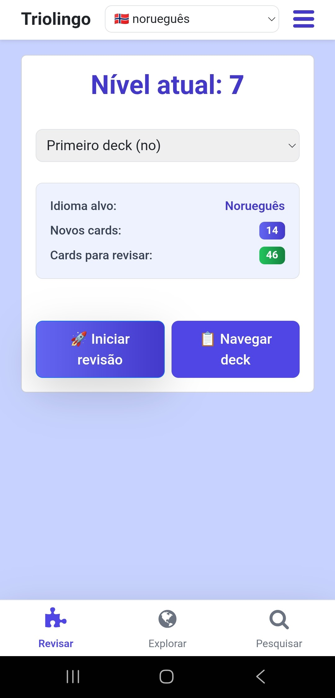

# **Sero: Sistema Inteligente para Aquisição de Idiomas**

O Sero é uma plataforma de aprendizagem de línguas desenvolvida especificamente para estudantes autodidatas que desejam superar o platô intermediário e alcançar a fluência. Diferente de métodos puramente passivos, o Sero foca na produção ativa e na decomposição estrutural do idioma de destino.

## ---

**Filosofia de Aprendizado**

A arquitetura do Sero baseia-se no princípio de que a fluência é atingida através da transição do reconhecimento passivo para a produção ativa. O aplicativo inverte a lógica tradicional de tradução, priorizando o fluxo do idioma nativo para o idioma alvo, forçando o cérebro a recuperar estruturas gramaticais e vocabulário de forma deliberada.

## **Principais Funcionalidades**

### **Sistema de Repetição Espaçada (SRS)**

Utilizando algoritmos de repetição otimizados, o Sero organiza revisões de cards de forma a maximizar a retenção a longo prazo. O sistema adapta-se ao desempenho do usuário, garantindo que o esforço seja concentrado nos termos e estruturas de maior dificuldade.

### **Abordagem Baseada em Produção**

O núcleo da experiência de aprendizado é a tradução inversa. Ao apresentar sentenças no idioma nativo para serem vertidas ao idioma alvo, o Sero elimina a ilusão de competência que ocorre na leitura passiva, solidificando a capacidade de comunicação real.

  

### **Análise Lexical e Decomposição de Texto**

Uma das ferramentas mais poderosas do Sero é a capacidade de análise de texto integrada. O sistema permite que o usuário insira textos complexos, que são automaticamente fragmentados em "chunks" (blocos de significado). Essa análise identifica classes gramaticais e permite que o estudante compreenda a anatomia de cada frase antes de adicioná-la ao seu deck de estudos.

### **Integração com Conteúdo Autêntico e Busca Unificada**

  
  

O aplicativo oferece um módulo de exploração que conecta o usuário a fontes reais de notícias e mídia do país de origem do idioma estudado. Além disso, conta com uma busca unificada que agrega provedores como Dict.cc e Tatoeba, oferecendo definições precisas e exemplos de uso em contextos variados.

### **Progressão e Gamificação Estruturada**

  

Para manter a consistência necessária no estudo autodidata, o Sero implementa um sistema de níveis e metas diárias. Essa gamificação é tratada como um indicador de progresso técnico, transformando a disciplina em um processo visualmente mensurável.

## ---

**Aspectos Técnicos**

* **Gerenciamento de Decks:** Organização personalizada de conteúdo por temas ou níveis de prioridade.  
* **Suporte a Sentenças:** Foco em frases completas em vez de palavras isoladas, proporcionando contexto gramatical.  
* **Interface Focada em Produtividade:** Design limpo e funcional, minimizando distrações durante as sessões de revisão.
